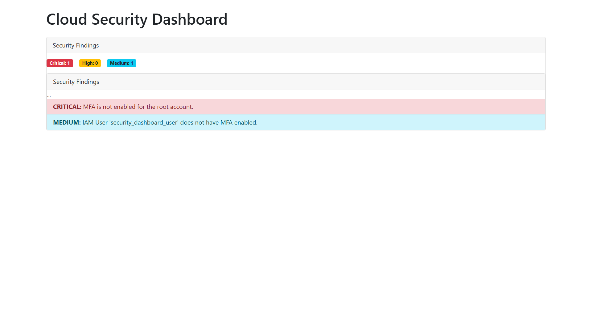

# AWS Cloud Security Dashboard

This project is a simple, Python-based web application that scans an AWS environment for common security misconfigurations and displays them in a user-friendly dashboard.



## Key Features

This tool automatically checks for the following security vulnerabilities:
- **Root Account MFA:** Verifies that the account's root user has Multi-Factor Authentication enabled.
- **Insecure S3 Buckets:** Detects S3 buckets with weak or disabled "Block Public Access" settings.
- **Risky Security Groups:** Scans for security group rules that leave sensitive ports (like SSH/RDP) open to the entire internet.
- **Aged Access Keys:** Identifies active IAM user access keys that are older than 90 days.
- **IAM Users without MFA:** Finds IAM users who do not have an MFA device configured.

## Tech Stack

- **Backend:** Python, Flask
- **AWS Integration:** Boto3 SDK
- **Frontend:** HTML, Bootstrap 5

## Setup and Installation

To run this project locally, follow these steps:

1.  **Clone the repository:**
    ```sh
    git clone https://github.com/vikihacker1/cloud-security-dashboard.git
    cd aws-cloud-security-dashboard
    ```

2.  **Create a virtual environment:**
    ```sh
    python -m venv venv
    source venv/bin/activate  # On Windows use: venv\Scripts\activate
    ```

3.  **Install dependencies:**
    ```sh
    pip install -r requirements.txt
    ```

4.  **Configure AWS Credentials:**
    Ensure you have configured your AWS credentials. The script requires read-only permissions.
    ```sh
    aws configure
    ```

5.  **Run the application:**
    ```sh
    python app.py
    ```
    Open your browser and navigate to `http://127.0.0.1:5000`.
